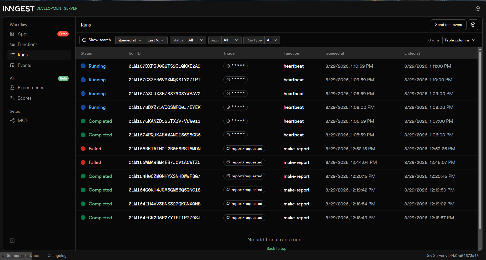

# Background Job API (Week 4, Assignment A7)

This is a fast API that offloads slow work (like report generation) to a background worker, and uses cron jobs for scheduled tasks. It uses **FastAPI** for the web server and **Inngest** for the background job orchestration.

## How to Run

You need two terminals to run this stack:

1. **Start the API:**
   ```bash
   uvicorn main:app --reload
Start the Inngest Dev Server:
code
Bash
npx inngest-cli@latest dev -u http://localhost:8000/api/inngest
Architecture
Endpoints:
| Method | Path | Description |
|---|---|---|
| GET | /health | Instant health check |
| POST | /reports | Fast door: Returns 202 Accepted instantly |
| GET | /reports/{id} | Status endpoint: Returns pending or done |
Background Functions:
| Name | Trigger | Description |
|---|---|---|
| say-hello | Event: test/hello | Sleeps for 5s, returns a greeting |
| make-report | Event: report/requested | Sleeps for 8s, updates report status to "done" |
| heartbeat | Cron: * * * * * | Runs every minute to log pending/done totals |
202 Proof & Eventual Consistency
When a report is requested, the API answers in milliseconds, and the work finishes later.
POST Request: Returns {"id": "...", "status": "pending"} (202 Accepted).
First Poll (GET): Returns {"id": "...", "status": "pending"}.
Second Poll (GET ~10s later): Returns {"id": "...", "status": "done", "result": "..."}.
Developer Notes
Validation vs. Retries: A wrong input (like a missing topic) must be rejected at the door with a 400 error, while temporary errors (like a broken database) happen in the background and deserve a retry.
Cron Schedules: The cron expression 0 8 * * * runs every day at 08:00. The cron expression 0 22 * * 0 runs every Sunday at 22:00.
Inngest Dashboard Screenshot
Below is a view of the background jobs running, retrying, and completing on schedule:
